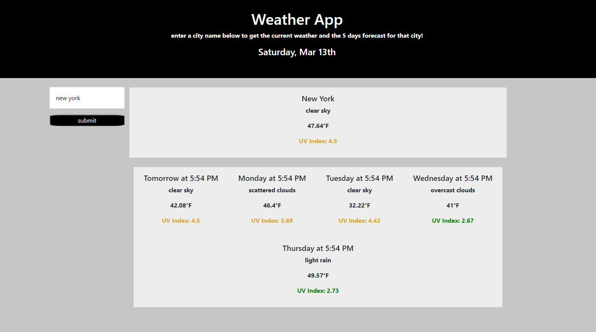

# Weather App

## Link to deployed site:
https://ray0095.github.io/weatherapp/ 

## Description 
The following files contain the necessary assets to deploy a functional weather app using the Open Weather API. Upon searching for a city name, the user is presented with the current weather in that city along with the 5 day forecast for that city. The font color of the UV index changes based on whether or not the condition is favorable.  

## Table of Contents

* [Installation](#installation)
* [Features](#features)
* [Screenshots](#screenshots)

## Installation

To use this site for your own website or your client's website, follow these steps: 
    1. Fork this repo 
    2. Create a local clone of your fork 
    3. Change styles to fit your branch :)

## Features

The application features Moment.js, the Open Weather API, and dynamically created elements using javascript. 

# Screenshot

